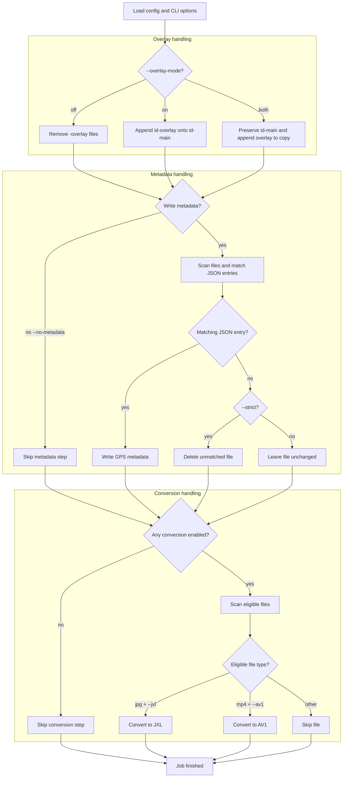

# Snapchat Memories Extractor

## Background

Snapchat's data export gives you a JSON file with dates and GPS coordinates,
and a folder of your actual memory files - but they're disconnected from
each other. Exported files carry only datetime metadata and open exactly as they were
taken. Some memories are also exported as two separate files rather than
one merged image or video: a `-main` file (the original photo/video) and a
`-overlay` file (the caption, stickers, and drawings you added, as a
transparent PNG layer).

This tool bridges that gap entirely offline: it pairs up `-main`/`-overlay`
files, merges the overlay into the media, matches each pair back to its
entry in the export JSON by embedded capture date, and embeds the correct
location straight into each photo and video. For anyone who wants
smaller files, it also supports re-encoding into JPEG XL and AV1, which cut
file size by 20-40% and 30-50% respectively with no visible quality loss.

Overlay merging, location metadata embedding, and format conversion are all optional
and can be toggled independently.

<p align="center">
  
  <br><em>Pairs and merges overlays, transcodes to JXL/AV1, embeds metadata</em>
</p>

## Features

- **Local-first** — works entirely from an export already sitting on disk; no download links, no expired links, no network access at all
- **Overlay merging** — applies caption, sticker, and drawing layers from `<id>-overlay` files onto photos and videos.
- **Metadata embedding** — writes GPS into images and videos
- **Image conversion** — JPEG → JPEG XL, lossless, 20-40% smaller
- **Video conversion** — H.264 (default) or AV1 (SVT-AV1 / libaom-av1), with full quality and speed controls
- **Resumable pipeline** - records per-stage progress so failed files are skipped by later stages and can be retried deliberately
- **Interrupt-safe** — Ctrl+C finishes whatever pairs are already in flight before exiting cleanly, no half-written files left behind
- **Zero system dependencies** — everything installs via pip

## Prerequisites

- **Python 3.10+**
- **macOS only**: [Homebrew](https://brew.sh/) with `jpeg-xl` package

## Quick Start

### Step 1: Download Your Snapchat Data

1. Go to [Snapchat Data Download](https://accounts.snapchat.com/accounts/downloadmydata).
2. Log in to the Snapchat account you want to extract memories from.
3. Select **both** options: `Export your Memories` and `Export JSON Files`.


### Step 2: Clone the Repository

```bash
git clone https://github.com/snapchat-memories-extractor/cli.git
cd snapchat-memories-extractor
```


### Step 3: Set Up Your Export

Once your Snapchat data export is ready and downloaded:

1. Extract the ZIP file you received from Snapchat (or multiple if you had a lot of memories).
2. Inside, you'll find `memories_history.json` and the 'memories' folder. (in case if you have multiple 'memories' folders, combine all files from them into one folder.)
3. Either move both 'memories' folder and json file into the `/data` folder (replacing the placeholders, if you wish), or point at their actual locations directly using
`--memories-json` (`-mj`) and `--memories-folder` (`-mf`) arguments when running
the tool.

### Step 4: Create a Virtual Environment

**Windows (PowerShell):**
```powershell
python -m venv .venv
.venv\Scripts\Activate.ps1
```

**macOS/Linux:**
```bash
python3 -m venv .venv
source .venv/bin/activate
```


### Step 5: Install Dependencies

**All platforms:**

```bash
pip install -r requirements.txt
```

**macOS only – Install JPEG XL tools:**

```bash
brew install jpeg-xl
```

> **Note:** On macOS, the JPEG XL converter (`cjxl`) is installed via Homebrew. On Windows and Linux, pre-compiled binaries are included in the repository.

**Linux only – Make the `cjxl` binary executable:**

```bash
chmod +x libjxl-binaries/linux/cjxl
```


### Step 6: Run the Extractor

If you moved both `memories_history.json` and your memories folder into `/data`:
```bash
python main.py
```

Or specify both paths directly:
```bash
python main.py --memories-json /path/to/memories_history.json --memories-folder /path/to/memories
```

**Done!** Your files will be saved to `downloads/`

## Configuration

### Normal Options

<details>
<summary><b>Memories JSON Path: -mj / --memories-json PATH</b></summary>

**What it does:**
- Specifies the path to the `memories_history.json` file exported from Snapchat
- **Default**: `data/memories_history.json` (relative to the project root)
- If you placed the file in the `/data` folder, you don't need this flag at all
- Only required when metadata writing is enabled. With `--no-metadata`, the JSON
  file is not read.

**Examples**:

Use default path (`data/memories_history.json`):
```bash
python main.py
```

Specify a custom path:
```bash
python main.py -mj /home/user/Downloads/memories_history.json
python main.py --memories-json C:\Users\user\Downloads\memories_history.json
```

**Recommendations:**
- **Default**: Simply move the file to the `data/` folder and run without this flag
- **Custom path**: Use `-mj` if you don't want to move the file or have multiple exports

</details>

<details>
<summary><b>Memories Folder Path: -mf / --memories-folder PATH</b></summary>

**What it does:**
- Specifies the path to the folder containing your exported memory files
  (the `<id>-main.<ext>` / `<id>-overlay.<ext>` pairs)
- **Default**: `data/memories` (relative to the project root)
- Scanned recursively, so it's fine if Snapchat's export nests files into
  dated subfolders
- If you placed the folder in `/data`, you don't need this flag at all

**Examples**:

Use default path (`data/memories`):
```bash
python main.py
```

Specify a custom path:
```bash
python main.py -mf /home/user/Downloads/memories
python main.py --memories-folder C:\Users\user\Downloads\memories
```

**Recommendations:**
- **Default**: Simply move the folder to `data/` and run without this flag
- **Custom path**: Use `-mf` if you don't want to move a large export, or want to keep it on an external drive

</details>

<details>
<summary><b>Output Directory: -o / --output PATH</b></summary>

**What it does:**
- Sets a custom output directory for all processed files
- **Default**: `downloads/` (relative to the project root)
- The directory will be created automatically if it doesn't exist

**Examples**:

Use default output directory (`downloads/`):
```bash
python main.py
```

Save to a custom directory:
```bash
python main.py -o /home/user/Pictures/snapchat
python main.py --output C:\Users\user\Pictures\snapchat
```

Save to an external drive:
```bash
python main.py -o /mnt/external/snapchat-backup
```

**Recommendations:**
- **Default**: Good for keeping everything within the project folder
- **Custom path**: Use `-o` to save directly to your photo library or an external drive

</details>

<details>
<summary><b>Logs Directory: -lp / --logs-path PATH</b></summary>

**What it does:**
- Sets a custom directory for log files
- **Default**: `logs/` (relative to the project root)
- The directory will be created automatically if it doesn't exist

**Examples**:

Use default logs directory (`logs/`):
```bash
python main.py
```

Save logs to a custom directory:
```bash
python main.py -lp /home/user/logs/snapchat
python main.py --logs-path C:\Users\user\logs\snapchat
```

**Recommendations:**
- **Default**: Good for keeping logs within the project folder
- **Custom path**: Use `-lp` if you want to centralize logs or store them on a different drive

</details>

<details>
<summary><b>Pipeline State: -rs / --reset-state and -rf / --retry-failed</b></summary>

**What it does:**
- Keeps a temporary sidecar state file while a run is incomplete
- Saves state under `.snapchat-memories/` in the project folder
- Tracks overlay, metadata, and conversion results per file
- If one stage fails for a file, later stages skip that file instead of touching it
- Deletes the state file automatically when a run finishes without failures
- Keeps the state file after failures or interruption so the next run can resume

**Flags:**

| Flag | Short | Behavior |
|---|---|---|
| `--reset-state` | `-rs` | Delete saved pipeline state before running and process from scratch |
| `--retry-failed` | `-rf` | Retry failed stages and stages skipped because of earlier failures |

**Examples**:

Resume from saved state automatically:
```bash
python main.py
```

Retry failed files:
```bash
python main.py --retry-failed
```

Ignore saved state and start fresh:
```bash
python main.py --reset-state
```

**Recommendations:**
- **Default resume**: Best after an interruption or crash
- **`--retry-failed`**: Use after fixing the cause of failures, such as a bad input file or missing encoder
- **`--reset-state`**: Use when you want the app to forget previous progress for this memories folder

</details>

<details>
<summary><b>Stage Concurrency: --overlay-applier-concurrency / --gps-writer-concurrency / --jxl-converter-concurrency / --av1-converter-concurrency N</b></summary>

**What it does:**
- Controls how many expensive operations can run at once for each processing stage
- **Default**: `10` for every stage
- Overlay concurrency applies only when `--overlay-mode` is `on` or `both`
- GPS writer concurrency applies only when metadata writing is enabled
- JXL converter concurrency applies only when `--jxl` is enabled
- AV1 converter concurrency applies only when `--video-codec av1` is enabled
- If a stage is disabled, its concurrency value is ignored

**Flags:**

| Stage | Long flag | Short flag | Default |
|---|---|---|---|
| Overlay applier | `--overlay-applier-concurrency N` | `-oac N` | `10` |
| GPS metadata writer | `--gps-writer-concurrency N` | `-gwc N` | `10` |
| JXL converter | `--jxl-converter-concurrency N` | `-jcc N` | `10` |
| AV1 converter | `--av1-converter-concurrency N` | `-acc N` | `10` |

**Examples**:

Use defaults:
```bash
python main.py
```

Limit overlay compositing and metadata writing:
```bash
python main.py --overlay-applier-concurrency 4 --gps-writer-concurrency 6
```

Run more JXL conversions in parallel:
```bash
python main.py --jxl --jxl-converter-concurrency 12
```

Set AV1 concurrency. This is ignored unless AV1 conversion is enabled:
```bash
python main.py --av1-converter-concurrency 2
python main.py --video-codec av1 --av1-converter-concurrency 2
```

**Recommendations:**
- **Overlay/GPS 5-10**: Safe default range for most machines
- **JXL/AV1 1-4**: Better for CPU-heavy conversion on laptops or smaller CPUs
- **Higher values**: Useful on high core-count CPUs, but watch memory and thermals

</details>

<details>
<summary><b>Overlay Handling: -om / --overlay-mode [on|off|both]</b></summary>

**What it does:**
- Snapchat stores your memories separately with layers for text, stickers, drawings, etc. (overlays) you added.
- **`on` (default)**: Composites the overlay into the main file, exactly like you see it in the Snapchat app, then deletes both original source files
- **`off`**: Deletes the overlay file without compositing it, leaving the original file untouched
- **`both`**: Creates copy of original file, applies overlay on it and then deletes the overlay, leaving you with both copies of memory.

**Examples**:

Default behavior - composite overlays, keep only the merged result:
```bash
python main.py
```

Skip overlays entirely - keep only clean originals:
```bash
python main.py -om off
```

Keep both the clean original and a separate overlaid version:
```bash
python main.py -om both
```

**Recommendations:**
- **`on` (default)**: Best for preserving your memories exactly as you saved them in Snapchat, without keeping duplicate files around
- **`off`**: Best if you want clean, unedited originals for editing or archival, and don't care about the caption/sticker layer
- **`both`**: Best if you want both versions and have the disk space to spare - note that combined with `--video-codec av1`, this means every overlaid video gets encoded twice

</details>

<details>
<summary><b>Strict Location: -s / --strict</b></summary>

**What it does:**
- By default, a file that doesn't have location entry in JSON is left
  untouched on disk (no metadata written)
- With `--strict`, files without location entry are **permanently deleted** instead

**Examples**:

Default - files without location are left alone:
```bash
python main.py
```

Strict - delete files that don't have location:
```bash
python main.py -s
python main.py --strict
```

**Recommendations:**
- **Default**: Safest option. Review what ends up unmatched before deciding whether to clean it up yourself
- **`--strict`**: Only use once you're confident you don't need files without location - this deletes your local copy of them, permanently

</details>

<details>
<summary><b>Metadata Embedding: -M / --no-metadata</b></summary>

**What it does:**
- **By default**, this tool embeds GPS location metadata into every photo and video that has GPS data available
- Use `--no-metadata` if you want to skip writing metadata entirely
- With `--no-metadata`, `memories_history.json` is not required or read
- Files with no GPS data available will never get metadata regardless of this flag, as there's nothing to write

**Examples**:

Default behavior - embeds location metadata on matched files:
```bash
python main.py
```

Skip metadata - process files WITHOUT embedded GPS metadata:
```bash
python main.py -M
```

**Recommendations:**
- **Default (with metadata)**: Best for organizing photos by map (if your photo app supports this feature) and viewing them in photo apps with proper locations
- **With `--no-metadata`**: Use if you prefer to manage GPS metadata separately or want faster processing

</details>

<details>
<summary><b>JPEG Quality: -q / --jpeg-quality N</b></summary>

**What it does:**
- Controls the compression quality of JPEG image encoding when applying overlays or writing metadata
- **Default**: `95` (high quality, minimal compression)
- **Range**: 1-100 (1 = maximum compression, 100 = maximum quality)
- Lower values = smaller files but visible quality loss
- Higher values = better quality but larger files

**Examples**:

Default quality (95):
```bash
python main.py
```

High compression for smaller files:
```bash
python main.py -q 85
```

Maximum quality:
```bash
python main.py -q 100
```

**Recommendations:**
- **95 (default)**: Best balance of quality and file size
- **85**: Good for backups, slight quality loss (often imperceptible)
- **75**: Aggressive compression, noticeably smaller files, visible quality loss on close inspection
- **100**: Maximum quality, larger files, rarely worth the trade-off from 95

</details>

<details>
<summary><b>JPGXL Conversion: -J / --jxl</b></summary>

**What it does:**
- **By default**, processed JPEG images are kept in their original **JPEG** format
- Use `--jxl` to convert JPEG images to the modern **JPGXL (JXL)** format
- JPGXL provides lossless compression with typically **20-40% better compression** than JPEG
- All metadata (date, GPS coordinates, image properties) is preserved during conversion

**Examples**:

Default behavior - keep original JPEG files:
```bash
python main.py
```

Enable JPGXL conversion:
```bash
python main.py -J
python main.py --jxl
```

**Recommendations:**
- **Default (no conversion)**: Best compatibility with all devices and applications
- **With `--jxl`**: Best for storage and archival. Saves 20-40% space with perfect quality

**File Size Comparison:**

Example image (4000x3000 photo):
- Original JPEG: 3.2 MB
- Converted JPGXL (lossless): 1.9 MB
- **Savings: 40%** (no quality loss)

> **Compatibility Warning:** JPGXL is not yet widely supported by most photo gallery apps, cloud services, and operating system viewers. Use this option only if your workflow already supports JPGXL.

</details>

<details>
<summary><b>Video Codec: -vc / --video-codec [h264|av1]</b></summary>

**What it does:**
- Lets you choose the video codec for processed videos
- `h264` (default) is supported by nearly all devices and browsers
- `av1` produces significantly smaller files at the same quality, is royalty-free, but is slower to encode

**Examples**:

Default (h264):
```bash
python main.py
```

Use AV1 for more compact files:
```bash
python main.py --video-codec av1
```

**Recommendations:**
- Use `h264` for best compatibility (default)
- Use `av1` if you want the best compression and your devices support it

> **Note**: AV1 encoding is significantly slower than h264. See the [AV1 Options](#av1-options) section below for speed and quality controls.

</details>

### Advanced Options

> **Note:** With the default `--video-codec h264`, videos are encoded once using fixed, sane defaults (preset, `crf 23`, `yuv420p`) and are otherwise left alone — re-encoding is only triggered when `--video-codec av1` is set. Likewise, JPEGs default to quality 95 and are left byte-identical unless `--jxl` is set. All of the advanced tuning flags below (`--crf`, `--ffmpeg-pixel-format`, every `--av1-*` flag, `--film-grain`, `--grain-denoise`) only take effect during an actual AV1 or JXL conversion — set them freely, they're simply ignored otherwise.

<details>
<summary><b>FFmpeg Timeout: -f / --ffmpeg-timeout SECONDS</b></summary>

**What it does:**
- Sets how many seconds the program will wait for FFmpeg to finish before giving up on an operation
- **Default**: `60` seconds
- Increase if you have very large or slow-to-process video files

**Examples**:

Default (60 seconds):
```bash
python main.py
```

Wait up to 120 seconds for each FFmpeg operation:
```bash
python main.py -f 120
python main.py --ffmpeg-timeout 120
```

**Recommendations:**
- Increase for slow computers, large videos, or when encoding AV1 (which is slower than h264)

</details>

<details>
<summary><b>FFmpeg Preset: -fp / --ffmpeg-preset [preset]</b></summary>

**What it does:**
- Sets the h264 encoding speed preset, controlling the speed/compression tradeoff
- **Presets:** `ultrafast`, `superfast`, `veryfast`, `faster`, `fast`, `medium`, `slow`, `slower`, `veryslow`, `placebo`
- **Default:** `fast`
- Only applies when `--video-codec h264`. For AV1 speed control, use `--av1-preset` or `--av1-cpu-used` instead

**Examples**:

Use the default preset:
```bash
python main.py
```

Slower preset for better compression:
```bash
python main.py --ffmpeg-preset slow
```

Fastest preset (largest files, lowest CPU usage):
```bash
python main.py -fp ultrafast
```

**Recommendations:**
- `fast` or `medium` for a good balance of speed and file size
- `veryslow` or `placebo` only if you want the smallest possible files and don't mind long encoding times

</details>

<details>
<summary><b>Constant Rate Factor: --crf N</b></summary>

**What it does:**
- Sets the quality level for video encoding. Lower = better quality and larger files, higher = smaller files with lower quality
- **h264**: range 0–51, default `23`, typical range 18–28
- **AV1**: range 0–63, default `36`, typical range 28–40
- If not set, the per-codec default is used automatically

**Examples**:

Use defaults (23 for h264, 36 for av1):
```bash
python main.py
```

Higher quality h264:
```bash
python main.py --crf 18
```

Higher quality AV1:
```bash
python main.py --video-codec av1 --crf 28
```

Smaller files, lower quality:
```bash
python main.py --video-codec av1 --crf 42
```

**Recommendations for AV1:**
- **28–32**: High quality, larger files
- **33–38**: Good balance, visually close to lossless for most content
- **39–45**: Smaller files, some visible quality loss
- **0**: Lossless (very large files, rarely needed)

</details>

<details>
<summary><b>Pixel Format: -pf / --ffmpeg-pixel-format [format]</b></summary>

**What it does:**
- Sets the pixel format for video encoding, affecting color depth and compatibility
- All available formats are planar YUV and compatible with both h264 and AV1
- **Default:** `yuv420p` (widest compatibility)

**Available formats:**

| Format | Chroma subsampling | Bit depth | Notes |
|---|---|---|---|
| `yuv420p` | 4:2:0 | 8-bit | Default, maximum compatibility |
| `yuv422p` | 4:2:2 | 8-bit | Better color for video editing |
| `yuv444p` | 4:4:4 | 8-bit | Full color, largest files |
| `yuv420p10le` | 4:2:0 | 10-bit | HDR-capable, requires compatible player |
| `yuv422p10le` | 4:2:2 | 10-bit | 10-bit color for editing |
| `yuv444p10le` | 4:4:4 | 10-bit | Full 10-bit color, largest files |

**Examples**:

Use the default pixel format:
```bash
python main.py
```

Use 10-bit for HDR-compatible output:
```bash
python main.py -pf yuv420p10le
```

Full color subsampling:
```bash
python main.py -pf yuv444p
```

**Recommendations:**
- `yuv420p` for maximum compatibility with all devices and players
- `yuv420p10le` if you need 10-bit output for HDR workflows
- Only change this if you know your target device or player supports the chosen format

</details>

<details>
<summary><b>Log Level: -l / --log-level LEVEL</b></summary>

**What it does:**
- Controls how much information the program writes to log files
- **Default**: `0` (OFF, no logging)
- Accepts either a number (0–5) or a name

**Accepted values:**
- `0` / `OFF`: No logging (default)
- `1` / `CRITICAL`: Critical errors only
- `2` / `ERROR`: Errors and above
- `3` / `WARNING`: Warnings and above
- `4` / `INFO`: General progress updates
- `5` / `DEBUG`: Full debug output

**Examples**:

Show only errors:
```bash
python main.py -l 2
python main.py --log-level ERROR
```

Show all debug output:
```bash
python main.py -l 5
python main.py --log-level DEBUG
```

**Recommendations:**
- `-l 4` for general progress updates
- `-l 5` for troubleshooting
- Leave at default (OFF) for cleanest output

</details>

<details>
<summary><b>CJXL Timeout: -ct / --cjxl-timeout SECONDS</b></summary>

**What it does:**
- Sets how many seconds the program will wait for the `cjxl` JPEG XL encoder to finish before giving up
- **Default**: `120` seconds
- Only relevant when `--jxl` is enabled

**Examples**:

Wait up to 300 seconds for each JPEG XL conversion:
```bash
python main.py -ct 300
python main.py --cjxl-timeout 300
```

**Recommendations:**
- Increase for slow computers or very large images

</details>

<details>
<summary><b>Logs to Keep: -la / --logs-amount N</b></summary>

**What it does:**
- Sets how many log files to keep. Older log files beyond this count are deleted automatically
- **Default**: `5`

**Examples**:

Keep only the last 3 log files:
```bash
python main.py -la 3
```

Keep the last 10 log files:
```bash
python main.py -la 10
```

</details>

### AV1 Options

These options only apply when `--video-codec av1` is set.

<details>
<summary><b>AV1 Encoder: -ae / --av1-encoder [svt-av1|libaom-av1]</b></summary>

**What it does:**
- Selects the AV1 encoder implementation
- `svt-av1` (default): Developed by Intel/Netflix. Much faster, suitable for general use
- `libaom-av1`: The reference AV1 encoder. Slower but exposes more tuning options (see quality and speed controls below)

**Examples**:

Default (SVT-AV1):
```bash
python main.py --video-codec av1
```

Use libaom for maximum tuning control:
```bash
python main.py --video-codec av1 --av1-encoder libaom-av1
```

**Recommendations:**
- **svt-av1** (default): Best for most users — fast and produces excellent quality
- **libaom-av1**: Use only if you need advanced quality tuning options like `--av1-aq-mode`, `--av1-tune`, or `--av1-usage`

</details>

<details>
<summary><b>AV1 Encoding Speed: -ap / --av1-preset (SVT-AV1) | -acu / --av1-cpu-used (libaom)</b></summary>

**What it does:**
- Controls the speed/compression tradeoff for AV1 encoding
- Slower = better compression and quality, higher CPU usage
- Faster = quicker encoding, slightly larger files

**SVT-AV1** (`--av1-preset`, range 0–13, default: `8`):
- `0` = slowest, best compression
- `13` = fastest, largest files

**libaom-av1** (`--av1-cpu-used`, range 0–8, default: `4`):
- `0` = slowest, best compression
- `8` = fastest, largest files

**Examples**:

SVT-AV1, slower preset for better compression:
```bash
python main.py --video-codec av1 --av1-preset 4
```

SVT-AV1, faster preset for quicker encoding:
```bash
python main.py --video-codec av1 --av1-preset 11
```

libaom, balanced speed:
```bash
python main.py --video-codec av1 --av1-encoder libaom-av1 --av1-cpu-used 4
```

**Recommendations:**
- **SVT-AV1 preset 6–8**: Good balance of speed and quality for most uses
- **libaom cpu-used 3–5**: Good balance for libaom

</details>

<details>
<summary><b>AV1 Tiling: -atc / --av1-tile-columns | -atr / --av1-tile-rows</b></summary>

**What it does:**
- Splits the video frame into tiles that can be encoded in parallel, improving encoding speed on multi-core CPUs
- Values are log2: `0` = 1 tile, `1` = 2 tiles, `2` = 4 tiles, `3` = 8 tiles, etc.
- **Default**: `0` for both (single tile)
- Applies to both SVT-AV1 and libaom-av1

**Examples**:

Enable 2 tile columns and 2 tile rows (4 tiles total):
```bash
python main.py --video-codec av1 --av1-tile-columns 1 --av1-tile-rows 1
```

Enable 4 tile columns for wide videos on many-core CPUs:
```bash
python main.py --video-codec av1 --av1-tile-columns 2
```

**Recommendations:**
- Leave at `0` for most uses — tiling helps mainly on high-resolution video (1080p+) with many CPU cores
- `--av1-tile-columns 1 --av1-tile-rows 1` is a safe starting point if encoding feels slow

</details>

<details>
<summary><b>AV1 Row Multithreading: -arm / --av1-row-mt [0|1]</b></summary>

**What it does:**
- Enables row-based multithreading within each tile for libaom-av1, allowing more CPU cores to be used during encoding
- **Default**: `1` (enabled)
- Only applies when `--av1-encoder libaom-av1`

**Examples**:

Disable row multithreading:
```bash
python main.py --video-codec av1 --av1-encoder libaom-av1 --av1-row-mt 0
```

**Recommendations:**
- Keep at `1` (default) unless you have a specific reason to disable it

</details>

<details>
<summary><b>AV1 Adaptive Quantization: -aam / --av1-aq-mode [0-3]</b></summary>

**What it does:**
- Controls how libaom-av1 distributes bits across different parts of the frame
- `0` = off (default), `1` = variance-based, `2` = complexity-based, `3` = cyclic refresh
- Only applies when `--av1-encoder libaom-av1`

**Examples**:

Variance-based adaptive quantization:
```bash
python main.py --video-codec av1 --av1-encoder libaom-av1 --av1-aq-mode 1
```

**Recommendations:**
- Mode `1` (variance) or `2` (complexity) can improve perceived quality at the same file size for varied content
- Leave at `0` if unsure

</details>

<details>
<summary><b>AV1 Lookahead: -alf / --av1-lag-in-frames N</b></summary>

**What it does:**
- Sets how many future frames libaom-av1 looks ahead when making rate control decisions
- Higher values improve compression efficiency at the cost of memory and latency
- **Default**: `25`, **Maximum**: `35`
- Only applies when `--av1-encoder libaom-av1`

**Examples**:

Maximum lookahead for best compression:
```bash
python main.py --video-codec av1 --av1-encoder libaom-av1 --av1-lag-in-frames 35
```

Reduced lookahead to save memory:
```bash
python main.py --video-codec av1 --av1-encoder libaom-av1 --av1-lag-in-frames 10
```

**Recommendations:**
- Keep at `25` (default) or raise to `35` for best compression on longer videos

</details>

<details>
<summary><b>AV1 Tune: -at / --av1-tune METRIC</b></summary>

**What it does:**
- Tunes libaom-av1 encoding to optimise for a specific perceptual quality metric
- Choices: `psnr`, `ssim`, `vmaf_with_preprocessing`, `vmaf_without_preprocessing`, `vmaf_max_gain`, `butteraugli`
- **Default**: none (encoder uses its own balanced defaults)
- Only applies when `--av1-encoder libaom-av1`

**Examples**:

Tune for SSIM (general perceptual quality):
```bash
python main.py --video-codec av1 --av1-encoder libaom-av1 --av1-tune ssim
```

Tune for VMAF (Netflix's perceptual quality metric):
```bash
python main.py --video-codec av1 --av1-encoder libaom-av1 --av1-tune vmaf_with_preprocessing
```

**Recommendations:**
- Leave unset for most uses — the default produces good results across all content types
- `ssim` or `vmaf_with_preprocessing` are reasonable choices if you want to optimise for perceived visual quality

</details>

<details>
<summary><b>AV1 Usage Profile: -au / --av1-usage [good|realtime|allintra]</b></summary>

**What it does:**
- Sets the libaom-av1 encoding profile, which changes the overall encoding strategy
- `good` (default): Best quality/speed tradeoff for offline encoding
- `realtime`: Low-latency mode for live or real-time use cases
- `allintra`: Encodes every frame as an intra frame; useful for still image sequences
- Only applies when `--av1-encoder libaom-av1`

**Examples**:

Default (good quality):
```bash
python main.py --video-codec av1 --av1-encoder libaom-av1
```

Real-time encoding:
```bash
python main.py --video-codec av1 --av1-encoder libaom-av1 --av1-usage realtime
```

**Recommendations:**
- Keep at `good` (default) for all normal use cases

</details>

<details>
<summary><b>Film Grain Synthesis: -fg / --film-grain N</b></summary>

**What it does:**
- Enables AV1 film grain synthesis. Instead of encoding actual grain pixel-by-pixel, the encoder models and removes the grain from the source, stores it as metadata, and the decoder re-applies it on playback
- This can significantly reduce file size for noisy or grainy source footage
- **Range**: 0 (disabled) to 50 (strong grain), **Default**: `0`
- Applies to both SVT-AV1 and libaom-av1

**Examples**:

Light grain synthesis:
```bash
python main.py --video-codec av1 --film-grain 5
```

Strong grain synthesis for very noisy footage:
```bash
python main.py --video-codec av1 --film-grain 20
```

**Recommendations:**
- **0** (default): Use for clean, modern footage
- **3–8**: Subtle grain synthesis for footage with mild noise
- **10–20**: For clearly grainy footage (older recordings, low-light videos)
- **20+**: Only for extremely noisy source material

> **Note**: Film grain synthesis requires a decoder that supports AV1 grain metadata. Most modern AV1 decoders do, but check your player if you see unexpected grain behaviour.

</details>

<details>
<summary><b>Grain Denoise: -gd / --grain-denoise [0|1]</b></summary>

**What it does:**
- When film grain synthesis is enabled, controls whether the source is denoised before grain is modelled and re-synthesized on playback
- `1` (default): Denoise the source first, then re-apply synthesized grain — cleanest result
- `0`: Model grain from the raw source without denoising first
- Only applies when `--film-grain` is greater than `0`

**Examples**:

Disable denoising before grain synthesis:
```bash
python main.py --video-codec av1 --film-grain 8 --grain-denoise 0
```

**Recommendations:**
- Keep at `1` (default) for the best visual result

</details>

## Pipeline

<details>
<summary>Full pipeline diagram</summary>



</details>

## Troubleshooting

<details>
<summary><b>Missing 'memories_history.json' or Memories Folder</b></summary>

When exporting your data from Snapchat, make sure you select **both** options:
- **Export your Memories**
- **Export JSON Files**

Without both, either the JSON file or the actual media files won't be
included in your export. The memories folder is always required; the JSON
file is required only when metadata writing is enabled.

</details>

<details>
<summary><b>AV1 Encoding is Very Slow</b></summary>

AV1 encoding is significantly more CPU-intensive than h264. Try the following to speed it up:

- Use SVT-AV1 (default): `--av1-encoder svt-av1`
- Increase the preset: `--av1-preset 10` or higher (up to 13)
- Lower simultaneous AV1 encodes: `--av1-converter-concurrency 1` or `2`
- Enable tiling to use more CPU cores: `--av1-tile-columns 1 --av1-tile-rows 1`
- Raise the CRF slightly to reduce the amount of work: `--crf 40`

</details>

<details>
<summary><b>Still Having Issues?</b></summary>

Please open a new [issue](https://github.com/Reelinq/snapchat-memories-extractor/issues) with the following information:
- Your Python version (`python --version`)
- Operating system
- Error message or unexpected behavior
- Whether the issue is with images or videos

</details>

## License

GPLv3 License — see [LICENSE](LICENSE) file.

### Third-Party Licenses

| Component | Purpose | License | Source |
|-----------|----------|----------|---------|
| Python | Runtime | PSF License | https://www.python.org/psf/license/ |
| Pydantic | Configuration and data validation | MIT | https://github.com/pydantic/pydantic |
| Pillow | Image loading and overlay compositing | HPND | https://python-pillow.org/ |
| piexif | Reading/writing EXIF metadata on JPEG files | MIT | https://github.com/hMatoba/Piexif |
| imageio-ffmpeg | Bundled FFmpeg executable management | BSD-2-Clause | https://github.com/imageio/imageio-ffmpeg |
| libjxl (`cjxl`) | JPEG XL lossless conversion | BSD-3-Clause | https://github.com/libjxl/libjxl |
